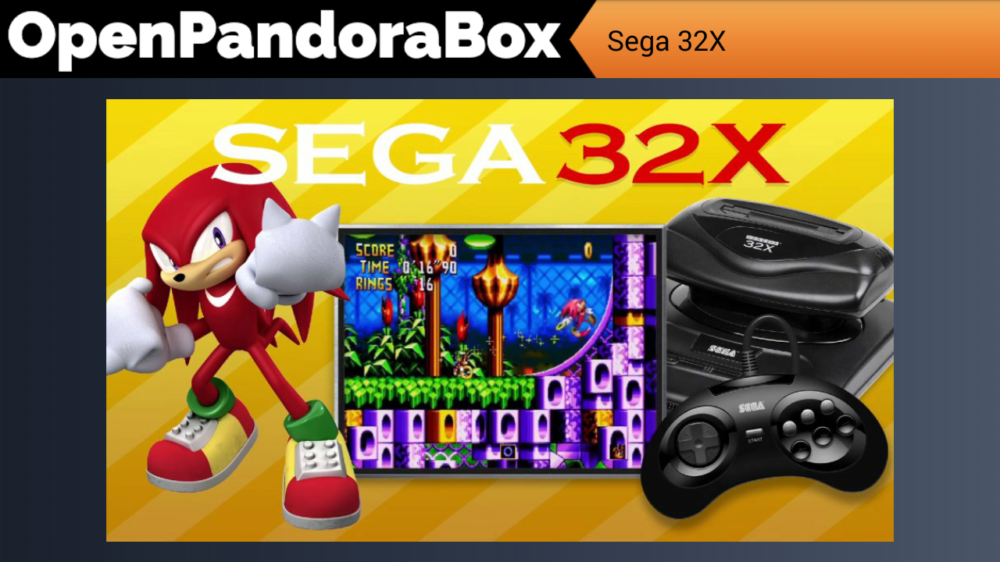
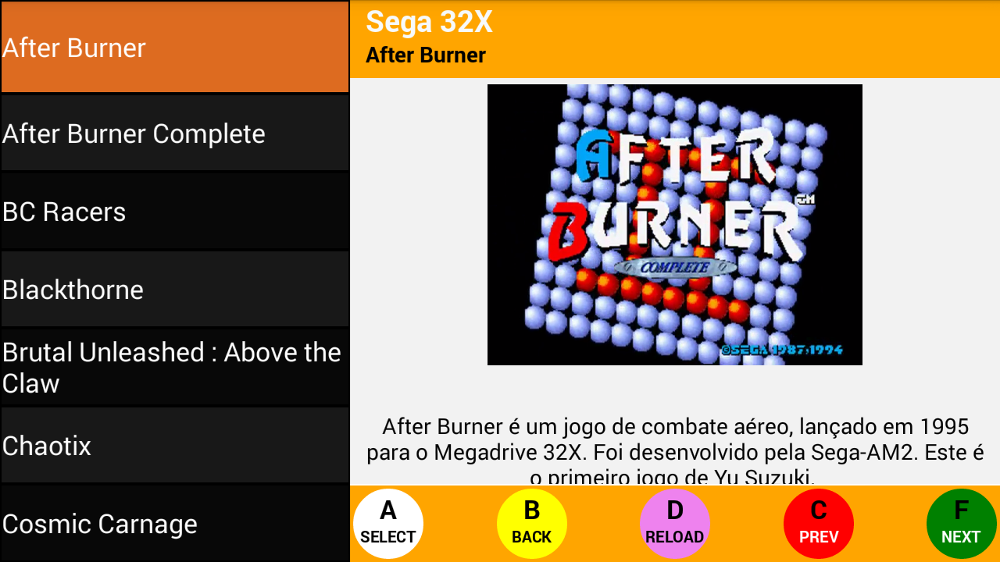

### A Pandora Box 3D's Front-End

Another emulator frontend using RetroArch.

It is suppose to be used with pandory on pandora box 3d plus.

### Platform Selection

### Game Selection

## Installation

1 - Install the apk
2 - update the config.json on /data/data/com.openpandorabox/files
3 - update the keymap.json on /data/data/com.openpandorabox/files
4 - Done

This frontend will look for gamelist.xml, to get the path, name, desc, image and video.

You can generate a gamelist.xml for each platform with  a external tool like skraper.

## Motivation.
The default pandora box 3d frontend is good, but I can't configure games property.

I tried to find a frontend on playstore but none works well with the default arcade controls on pandory box 3D.

I hate to use mouse and keyboard on pandory box, so I created this frontend.

It is not great but it is a honest job.

