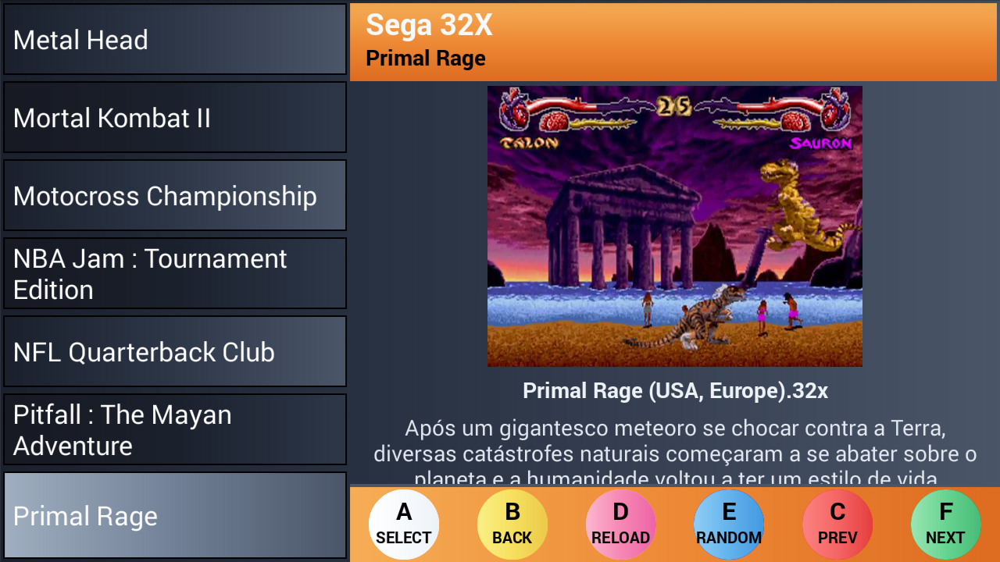

### A Pandora Box 3D's Front-End

Another emulator frontend using RetroArch.

It is suppose to be used with Pandory on Pandora Box 3D Plus.

It could be used with **NVIDIA Shield Portable** as well as I am using it to debug.

### Platform Selection

### Game Selection

### Features
- Touch screen is not required anywhere.
- Use same configuration for images, videos and descriptions as **EmulationStation** (batocera, recalbox, etc)
- Select which Retroarch core to use for each platform
- Works with Drastic, Retroarch, Reicast, MupenPlus FZ, PPSSPP
- History Games
- Select a random game, because you can't decide what to play next \o/
- Search a game in all platforms
- Custom **file browser**, so you do not need a xkeyboard or touch screen to set a configuration option
- Custom **keyboard viewer**, so you can search a game without using touch screen

## Installation

1 - Install the apk

2 - Update the path settings on Settings -> General

3 - Update the platform settings on Settings -> Platforms

4 - Done

It is possible to customize the settings directly on these files:

- /data/data/com.openpandorabox/files/config.json
- /data/data/com.openpandorabox/files/keymap.json

This frontend will look for gamelist.xml, to get the path, name, desc, image and video.

You can generate a gamelist.xml for each platform with  a external tool like skraper.

### If you have a emulationstation installation like batocera/recalbox somewhere, just copy the base ROM folder somewhere on pandora box, install the retroarch cores and you are done.

## Motivation.
The default Pandora Box 3D interface is good, but I can't configure games individually.

I tried to find a frontend on playstore but none works well with the default arcade controls on Pandory Box 3D.

I hate to use mouse and keyboard on pandory box, so I created this frontend.

It is not great but it is a honest job.
